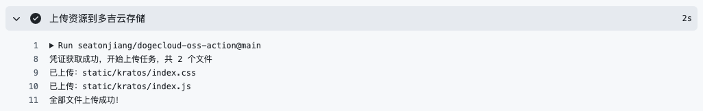

# DogeCloud OSS Action

使用 GitHub Action 上传文件或目录到多吉云存储



## 🚀 用法示例

上传 `dist` 目录下的所有文件到存储空间中指定的 `assets` 目录：

```yaml
- name: "上传资源到多吉云存储"
  uses: seatonjiang/dogecloud-oss-action@main
  with:
    access_key: ${{ secrets.DOGECLOUD_ACCESS_KEY }}
    secret_key: ${{ secrets.DOGECLOUD_SECRET_KEY }}
    bucket: ${{ secrets.DOGECLOUD_BUCKET }}
    local_path: dist
    remote_path: assets
```

> 提示：`access_key`、`secret_key`、`bucket` 需要使用 GitHub Secrets 存储，避免明文暴露在代码中。

## 📚 参数说明

| 参数 | 是否必填 | 描述 |
| :---: | :---: | ---- |
| `access_key` | 是 | AccessKey，可以在「[多吉云 - 用户中心 - 密钥管理](https://console.dogecloud.com/user/keys)」中获取 |
| `secret_key` | 是 | SecretKey，可以在「[多吉云 - 用户中心 - 密钥管理](https://console.dogecloud.com/user/keys)」中获取 |
| `bucket` | 是 | 存储空间名称，可以在「[多吉云 - 云存储 - 存储空间列表](https://console.dogecloud.com/oss/list)」中获取 |
| `local_path` | 是 | 需要上传的目录（`dist`）或文件（`dist/index.js`）|
| `remote_path`| 否 | 保存到存储空间的路径，不填默认上传到根目录 |

## 💖 项目支持

如果这个项目为你带来了便利，请考虑为这个项目点个 Star 或者通过微信赞赏码支持我，每一份支持都是我持续优化和添加新功能的动力源泉！

<div align="center">
    <b>微信赞赏码</b>
    <br>
    
</div>

## 🤝 参与共建

我们欢迎所有的贡献，你可以将任何想法作为 [Pull Requests](https://github.com/seatonjiang/dogecloud-oss-action/pulls) 或 [Issues](https://github.com/seatonjiang/dogecloud-oss-action/issues) 提交。

## 📃 开源许可

项目基于 MIT 许可证发布，详细说明请参阅 [LICENSE](https://github.com/seatonjiang/dogecloud-oss-action/blob/main/LICENSE) 文件。
